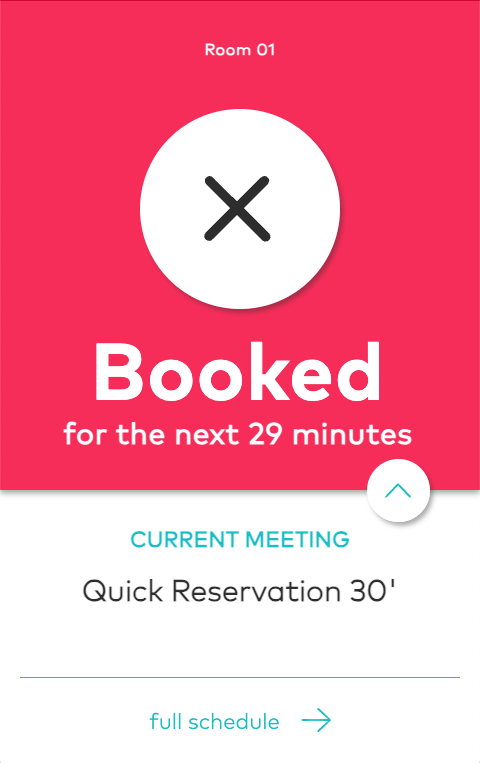
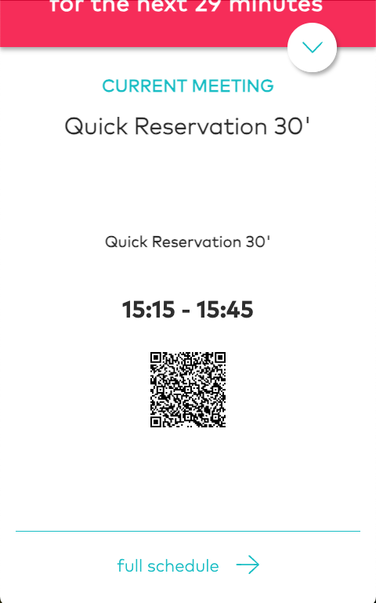

# Booking pal

Raspberry PI powered meeting room display with a booking assistant

Room is free

<br/>

Room is booked

<br/>

Booking details

<br/>
## Features

* Display the current and next meeting
* Agenda
* Booking assistant
* Meeting room status
* Meeting link with QR code

## Configuration

Booking Pal is using a service account key to connect to Google Calendar API. The service account key should be generated in JSON format and placed in config folder with the name of `service_key.json`.

To configure the service account for google calendar API, follow the steps below:

1. Go to [Google Cloud Console](https://console.cloud.google.com/)
2. Create a new project
3. Go to [Google Calendar API](https://console.cloud.google.com/apis/library/calendar-json.googleapis.com)
4. Enable the API
5. Go to [Google Cloud Console Credentials](https://console.cloud.google.com/apis/credentials)
6. Create a new service account
7. Download the service account key in JSON format and place it under config folder with the name of `service_key.json`

> You may need to share your calendar with the service account email address.

Please refer to this documentation on how to configure the service account key: [https://developers.google.com/identity/protocols/oauth2/service-account](https://developers.google.com/identity/protocols/oauth2/service-account)

## Running the application

For the development setup, you can use webpack dev server to run the application logic with Hot Module Replacement (HMR) enabled.

```bash
npm run watch
```

Then you can start the electron application with the following command:

```bash
npm run start
```

## Building the application

Use the provided scripts to build the application then run the package scripts to bundle as a single electron app.

Build with production mode:

```bash
npm run build
```

Package the application for Raspberry Pi (armv7l chipset):

```bash
npm run pack:pi
```

### Base project

This project is based on the code of the awsome sitincator project which are no longer maintained. Hats off to the original authors of this [sitincator!](https://github.com/simplificator/sitincator)

Working copy is available at the fork of the repo at [sitincator](https://github.com/Lilanga/sitincator)

### Supporters

Project coding is encouraged by following artists with their awesome work:

* [Manic Street Preachers: Resistance Is Futile](https://open.spotify.com/album/1R2rsEUqXjIvAbzM0yHrxA)
* [Metallica: Metallica](https://open.spotify.com/album/2Kh43m04B1UkVcpcRa1Zug)
* [Maxthor: Another World](https://open.spotify.com/album/3tklE2Fgw1hCIUstIwPBJF)
* [CCR: CCR](https://open.spotify.com/artist/3IYUhFvPQItj6xySrBmZkd)
* [BonJovi: BonJovi](https://open.spotify.com/artist/58lV9VcRSjABbAbfWS6skp)
